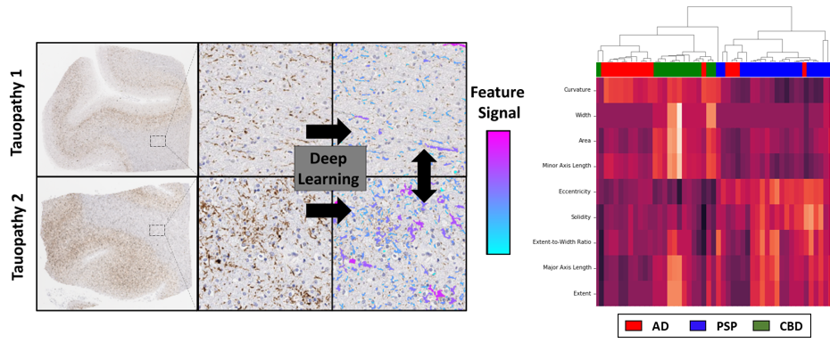
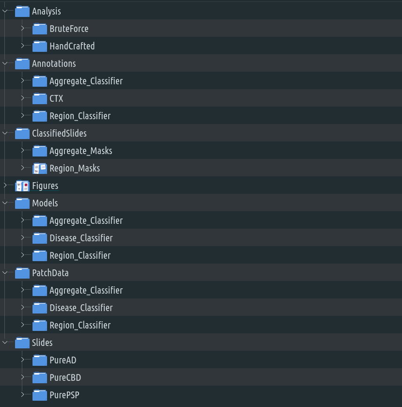
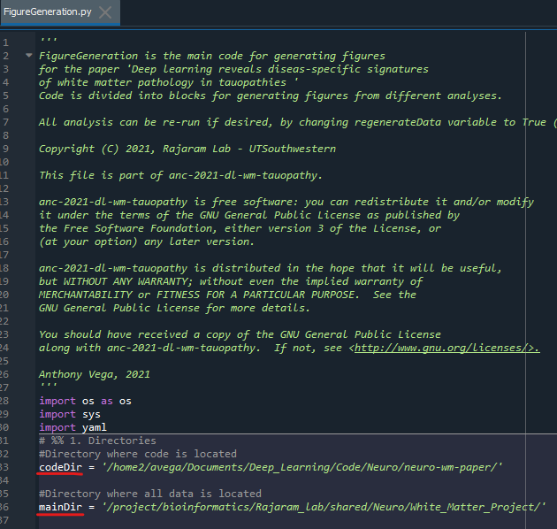
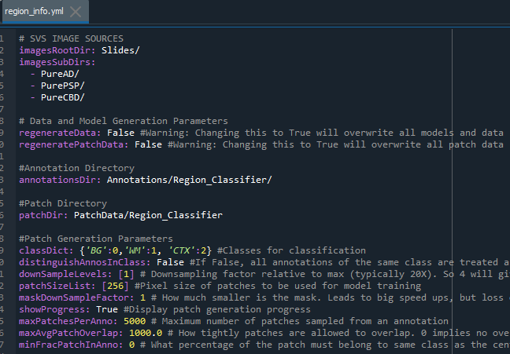

# Deep learning reveals disease-specific signatures of white matter pathology in tauopathies
Code for the paper "Deep learning reveals disease-specific signatures of white matter pathology in tauopathies" by Vega *et al* published in Acta Neuropathologica Communications

Manuscript
(https://doi.org/10.1186/s40478-021-01271-x)

# Set-up & Running Source Code
All code was developed and tested on a singularity image based on Ubuntu 18.04 running Python 3.6.9, tensorflow 2.0.0, and scikit-learn 0.21.3. All packages used in this code are included in the container, except for statannot (https://github.com/webermarcolivier/statannot) which was used for adding statistical information to two figures. For convenience to the user, we have included the version of statannot used by our code as part of this repository, but note that it was cloned directly from the parent Github repository.

## Installation Steps

### Containers 
- Set-up compute environment with containers:
    - Install [Singularity](https://sylabs.io/docs/)
      - Code was tested with Singularity 2.6.1 on a RedHat linux host
      - Based on a docker image, so likely docker compatible
    - Ensure CUDA 10.1+ compatible GPU and drivers (e.g. V100) are present.  
    - Pull image file from [Docker Hub](https://hub.docker.com/layers/srajaram/lab_img/v2.14/images/sha256-f307fdf489b509740758813abef603f931993ce9ea1979eb9d980853a4b52)
      - `singularity pull docker://srajaram/lab_img:v2.14`
    - Test GPU (make sure singularity image is in current working directory):
      -  `singularity exec --nv --cleanenv ./lab_img-v2.14.simg nvidia-smi`
    - Initialize Singularity image (make sure singularity image is in current working directory):
      - `singularity shell --nv -B /etc/machine-id -B /home2 ./lab_img-v2.14.simg`
    - Note: directories in above line (ex. home2) should be changed to reflect where your container has been stored 
###  Data:

The code assumes that the data is organized as shown below. Starting with the raw data (Slides and Annotations), it generates patches, models, performs inference and generates the figures for the paper as explained below.

The datasets analyzed during the current study available from the corresponding author, **Satwik Rajaram** (satwik.rajaram@utsouthwestern.edu), on reasonable request.

## Running the code
### Figure Generation (`FigureGeneration.py`)

All main and supplementary figures from the publication can be easily regenerated through the use of a single script shown below. 

1. Navigate to the folder where you have cloned this repository and start editing `FigureGeneration.py` 
2. Change the directories underlined below in red to correspond to the locations where these reside on your machine:
   - `codeDir` is the folder where you have clone the code
   - `mainDir` is the root folder containing the data organized as depicted above. 

3. In your terminal navigate to the code folder and  run:
   `singularity exec --nv -B /etc/machine-id -B /home2 pathToImgFile/lab_img-v2.14.simg python ./FigureGeneration.py`
   Note: modify directories such as `home2` as indicated above and `pathToImgFile` to indicate the folder where you saved the singularity image.

4. The script will automatically generate all figures used in the publication, and save them to the `Figures` folder. Note, it is also possible to run the code as individual cells inside an IDE such as spyder by connecting to the python kernel in the singularity image. 

   

### Changing Parameters and Regenerating Data

By default, the instructions provided above to generate figures make used of pre-trained models and saved intermediate results based on these models. If you wish to regenerate data (i.e., re-train deep learning models and redo inference), simply change the variable **regenerateData** to **True** in the appropriate yaml files: provided (see below). 

- `region_info.yml` : To redo identification of white-matter and cortex areas
- `aggregate_info.yml` : To redo identification of aggregates
- `handcrafted_info.yml` : To redo feature extraction on identified aggregates
- `disease_info.yml` : To redo disease classification based on white matter and cortex

- Then rerun the figure generation script as described above:

  `singularity exec --nv -B /etc/machine-id -B /home2 pathToImgFile/lab_img-v2.14.simg python ./FigureGeneration.py`

  Be advised that this takes a considerable amount of time and will overwrite all original data files. After data has been regenerated, figures will also be generated reflecting these new data.

- In addition to regenerating data, you may also adjust different parameters related to a given analysis. These parameters and their descriptions are also contained within the yaml files provided.

- Lastly, it is also possible to regenerate patch data that is used to train deep learning models. To do so, simply change the variable **regeneratePatchData** to **True**. Note that patch data is only regenerated if **regenerateData** has also been changed to **True**.   

 
